Bienvenue ! Ceci est une description du raytrace que j'ai développé dans le cadre du MOS 2.2 "Informatique Graphique" à l’École Centrale de Lyon - *Said Khaboud*
# pathtracer

### Intorduction:

La synthèse des images est utilisée dans de multiples domaines (cinéma, jeux-vidéos, etc.). Il
existe deux type de méthodes pour la synthèse d’image. La "rasterization", où l'on projette des formes
géométriques à l’écran. Dans le cadre de ce cours, nous avons vu l’autre type de méthode, appelée
"raytracing" ou "pathtracing", consistant à envoyer des rayons dans une scène par pixel et calculer leur couleur afin d'avoir un rendu plus réaliste. Cette méthode est moins rapide que la
première, mais permet d’obtenir des image beaucoup plus réalistes (en terme d’ombres, de textures,
etc.).
Ainsi, nous avons pu, à travers plusieurs étapes, construire petit à petit un moteur de rendu en
C++ qui fabrique des images de scènes définies en amont. Ce rapport sert à présenter les résultats
obtenus (images, temps d’exécution) afin d’illustrer les performances du moteur de rendu que j’ai
développé durant les séances dédiées.

### Ray Tracing primitif

Nous commençons donc l’étude par le cas le plus simple possible, on crée une sphère
de rayon r et on envoie un rayon à travers chaque pixel de notre image : si le rayon a une
intersection avec la sphère, alors le pixel est blanc, il est noir sinon.

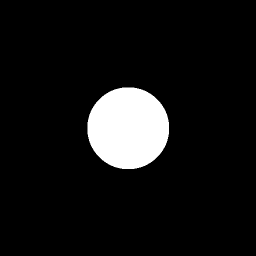

On obtient ainsi le résultat ci-dessus, on observe un cercle qui correspond à la projection
de la sphère sur le plan de l’image.

### Ajout de l'intensité lumineuse

On ajoute ensuite une source de lumière définie par sa position et son intensité. Maintenant, à chaque fois qu’il y a une intersection entre unobjet et le rayon qui part de la caméra, on calcule l’intensité lumineuse réfléchie par ce point de la sphère. Pour cela on calcule l’angle entre la normale à la surface de la sphère et le vecteur directeur de la direction entre ce point et la source de lumière ponctuelle. Cela va pondérer l’intensité de
chaque point.

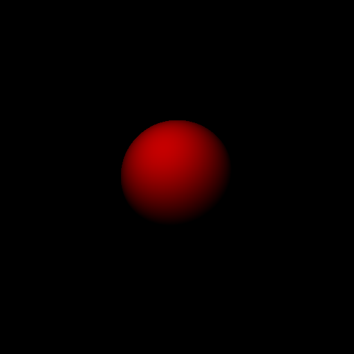

ainsi on obtient cette image qui a l'air d'être un peu plus en 3d.

### Création d'une scène

Pour créer une scène on rajoute des sphères géantes qui constitueront les murs de notre (chambre/scène).

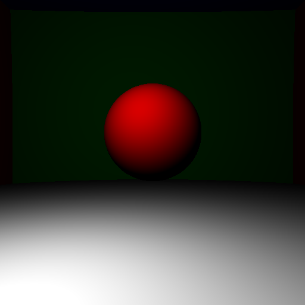

on remarque qu'on peut seulement voir le sol blanc, pour remédier à cela, on utilisera la correction gamma.

### Correction Gamma 

Afin d'améliorer le contraste des objets de la scène, on utilise la correction gamma afin d'obtenir une image plus claire avec un simple processus qui consiste à élever les valeur de la couleur à la puissance 0.45.

La correction Gamma permet d'obtenir le résultat ci-dessous.

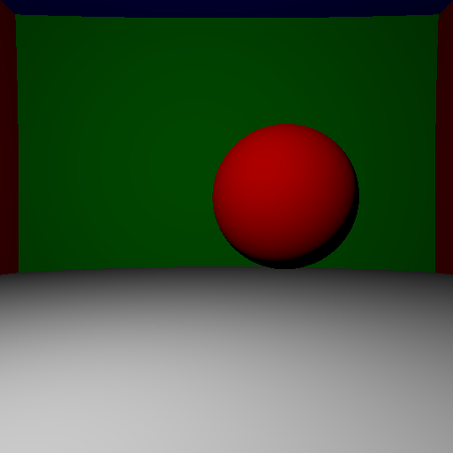

ainsi la correction gamma permet d'obtenirun meilleur rendu.

### Ombres portées

Une autre amélioration du rendu consiste à ajouter les ombres des objets. Donc, lorsqu'un rayon intersecte un objet on vérifie d'abor l'existence d'un autre objet entre la source et le point avant de calculer son intensité.
On rajoute un léger décalage afin d'éviter le bruit résultant des incertitudes du calcul.
On obtient donc le résultat suivant:

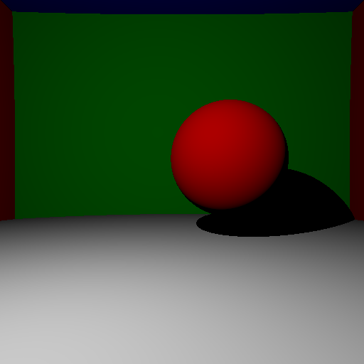

### Surfaces miroir

Cette fois ci, on souhaite changer la nature de la surface de la sphère. Dans ce cas, on va considèrera que la sphère a une surface miroir et donc reflète les rayons incidents.

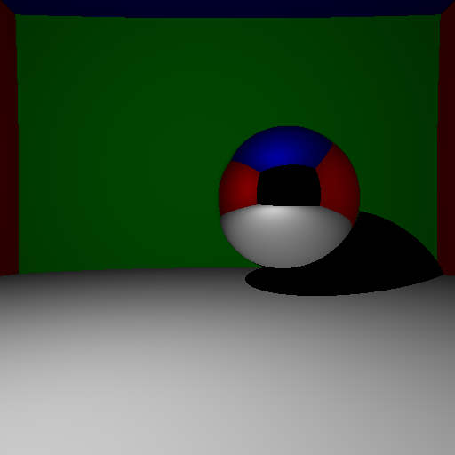

On voit bien la reflecion des murs sur la sphère.

### Surfaces transparentes 

On souhaite ensuite traiter le cas des objets transparent (en verre par exemple). Pour
cela on applique simplement les lois de l’optique géométrique : la loi de Snell-Descarte pour
calculer le rayon réfracté. On calcule ensuite récursivement la couleur du pixel à partir de
la nouvelle direction déterminée.

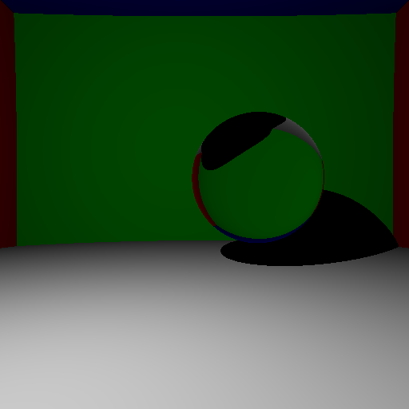

### anti-aliasing

En observant les images precedentes on remarque du crénelage sur les images, ceci est du au fait que les rayons passent par le centre des pixels d'où l'apparution de ces carrés.

afin de corriger ce problème on génère aléatoirement un certain nombre de rayons centrés autour du centre du pixel et on moyenne leur couleur afin d'obtenir des contours plus lisses.

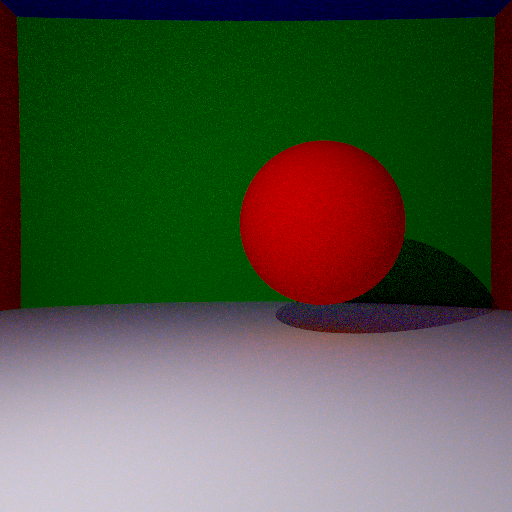

Cette image a été crée avec 10 rayons par pixel et a pris 90secondes pour l'éxecution.
En augmentant le nombre de rayons on obtient un rendu meilleur mais qui prend longtemps pour finir.

| 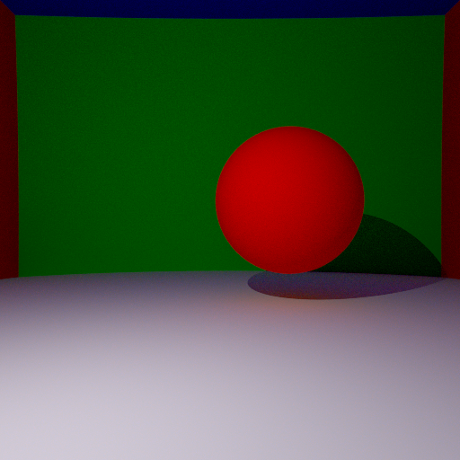 | 
|:--:| 
| *100 rayons par pixel. 887 seconds* |

### Parallélisation des calculs 

Etant donnée que chaque pixel de l'image est calculé à part, on peut donc paralléliser les calculs afin de réduire le temps d'exécution.

### Eclairage indirect 

Jusqu'à maintenant la source de lumière est le seul responsable de l'éclairage. Une amélioration de cela consiste à prendre en comptes les surfaces des autres objets de la scène et leur contribution. Pour se faire, nous allons pour chaque rayon, lors d'une intersection avec un objet considérer un autre rayon généré aléatoirement qui contribuera aussi à la couleur. 
Dans les images suivantes nous avons différenetes executions avec différents paramètres:

| 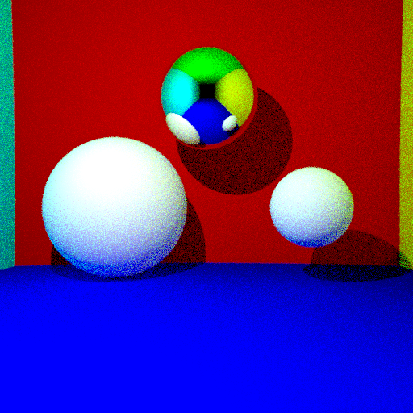 | 
|:--:| 
| *10 rayons par pixel. et 5 rebonds* |

| 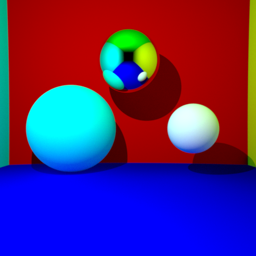 | 
|:--:| 
| *1000 rayons par pixel. et 5 rebonds* |

### Ombre douce et lumière étendues

Jusqu'au moment, la source de lumière a été un point, pour avoir un rendu plus réaliste, on envisage dans cette partie de considérer une source de lumière sphérique, et donc pour calculer l'effet de l'éclairage direct, différemment à ce qu'on faisait précedemment, cette fois ci, on génèrera aléatoirement un rayon allant de la sphère lumineuse à l'objet et voir s'il est obmré ou non.

Ainsi, on obtient les résultats suivants:

| 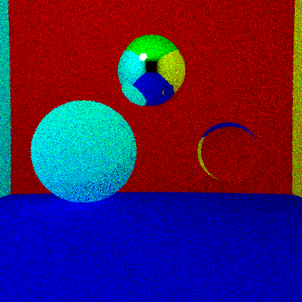 | 
|:--:| 
| *1 rayon par pixel. et 5 rebonds* |

| 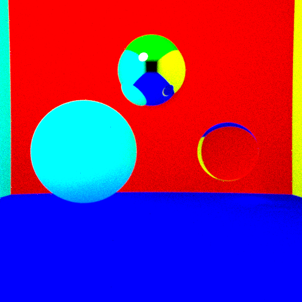 | 
|:--:| 
| *1000 rayons par pixel. et 5 rebonds, environ 20 minutes* |

| 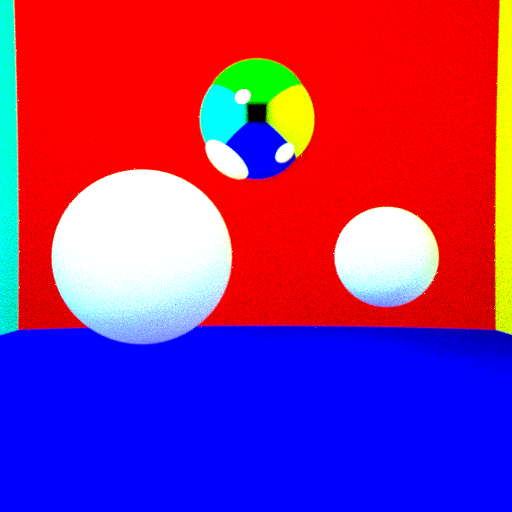 | 
|:--:| 
| *1000 rayons par pixel. et 10 rebonds, > 3 heures* |

## Feedback sur le MOS

- Points positifs :

  - cours très intéressant.
  - les techniques mises en places pour modéliser les différentes intéractions de la lumière sont très intéressantes.

- Point d'amélioration :
  - Il aurait été mieux de consacrer la première séance pour faire une petite introduction au c++ et installer l'environnement du développement, car la plupart des élèves en école d'ingénieurs n'ont pas trop d'expérience avec des langages de bas niveau.
  - Il aurait été aussi mieux d'étaler le cours sur une période plus longue afin de permettre aux élève qui ont pris du retard de rattrapper, car j'ai personellement trouvé le rythme du cours trop rapide.

